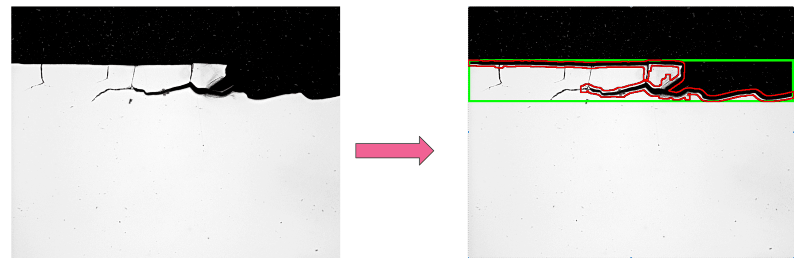
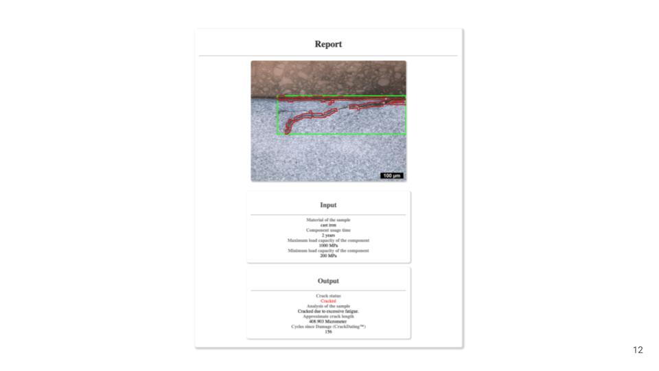

# Crake

Unsupervised crack detection and more for microscpopic metal surfaces. Uses no deep/machine learning but just image processing from opencv.





## Components
Cracke has the following components:
### Image Processing Pipeline (bounding_box.py)
 1. Median Blur Filtering
 2. Canny Edge Detection
 3. Morphological Segmentation
 4. Bounding Box Generation

### Crack Estimation Pipeline (report_output.py)
 1. Approximate Crack Length
 2 Use Paris Equation for crack propagation
 3. Compare with standard loading for a given material
 
### Report Generation Pipeline (generate_report.py)
 1. Status of the material
 2. Analysis of the image
 3. Estimate crack start and cause
 4. Generate report
 
### Flask App (run.py):
Contains the flask app code for the HackaTUM 2019 demo presentation. 

### Cross Platform App (/my_app/)
Coontains code for the ionic app.

### Requirements
python dependencies - see 'requirements.txt'
other dependencies: ionic.

### Running the App

* go to /app ```ionic cordova run browser```

for server go to /server ```python run.py```

HackaTUM Presentation: [Click Here.](https://docs.google.com/presentation/d/1rKQtiG4wDwnxOp7MqF_1gFau4qesZxwFFZdlHA-vDts/edit?usp=sharing)

Devpost Link: [Click Here](https://devpost.com/software/crack-e)

**PS:** The entire pipeline was coded in a day for the hackathon and therefore is crude and raw and at times even unintelligeble. We'll try to fix bugs and clean up the code as much as possible. In the meanwhile please also feel free to fork and contribute to our codebase. 

### Contributors

- Aadhithya Sankar [github](https://github.com/aadhithya/), [linkedin](https://www.linkedin.com/in/asankar96/)
- Abinav Ravi Venkatakrishnan [github](https://github.com/AbinavRavi), [linkedin](https://www.linkedin.com/in/abinav-ravi-venkatakrishnan/)
- Jyotirmay Senapati [github](https://github.com/jyotirmay123), [linkedin](https://www.linkedin.com/in/jyotirmay-senapati-30615421/)
- Abhijeet Parida [github](https://github.com/a-parida12), [linkedin](https://www.linkedin.com/in/a-parida/)

**HackaTUM 2019**

